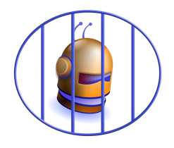
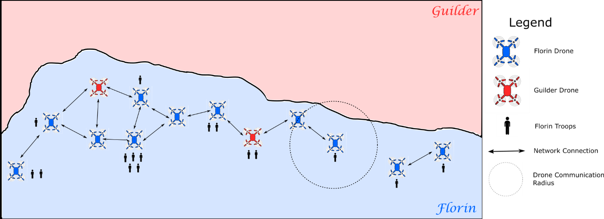
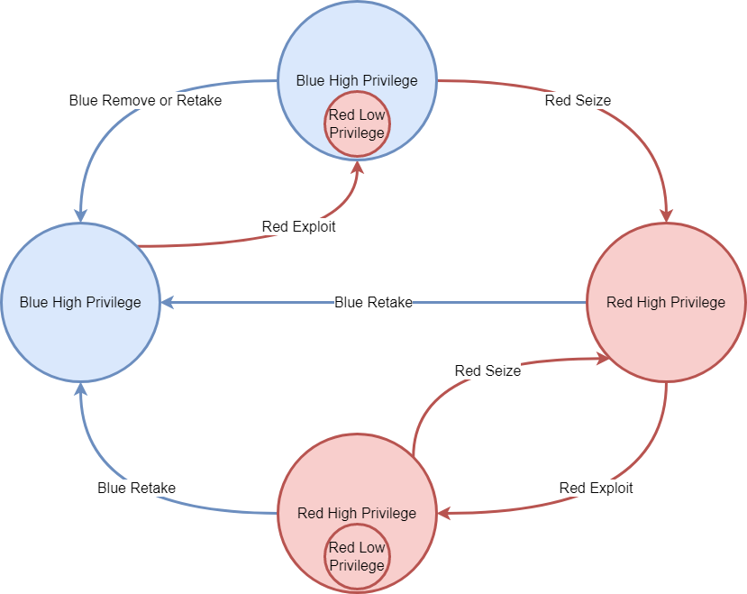

# TTCP CAGE Challenge 3

 

# Leaderboard
We are pleased to announce the following preliminary results for the TTCP CAGE Challenge 3.

| Rank | Team Name  | Method         | Mean of Validated Result  | Standard Deviation of Validated Result |
| --- | -------------------- | -------------------------- | ---------- | ----------- |
| 1 |Mindrake |CanaryVanillaPatch |-1577.695 |800.4111092 
| 2 |Mindrake | CanaryVanilla |-1579.651 |868.1013231 
| 3 |ja^3 |Manual Agent |-3055.36 |952.5201221

The current leader is team Mindrake who took the top two spots with their CanaryVanillaPatch and CanaryVanilla approaches, followed by team ja^3 with their Manual Agent approach. The validated scores in the preceding table were calculated by averaging over 1000 episodes using a random seed value of 523681.

Unfortunately we were unable to validate the remaining submissions as they did not pass the validation checks. We present the unverified results of _all_ submissions received in the table below (ordered alphabetically), together with a link for those submissions that have been made publicly available. Please note that these unverified scores are not directly comparable as they have been generated using different environments and random seeds. If any participant would like to have their submission validated please contact us via email at [cage.aco.challenge@gmail.com](mailto:cage.aco.challenge@gmail.com) __no later than 5 April 2023__. While we are unable to fix your submission on your behalf, we can provide guidance on how to get it to pass validation in the evaluation environment. Also if you would like to make your submission publically available please email us a link for inclusion in the table below.

| Team Name  | Method         | Mean of Unverified Score  |  Standard Deviation of Unverified Score | Link to submission |
| -------------------- | -------------------------- | ---------- | ----------- | ----------- |
| Experimental Novice  | Observational DQN          | \-6422.44  | 2105.202293 | |
| ja^3                 | Manual Agent               | \-2903.99  | 910.6008838 | |
| L1NNA                | PPO                        | \-4945.16  | 2249.683995 | https://github.com/NoorElAlfi/CC3_sub |
| Mindrake             | CanaryVanilla              | \-1634.6   | 925.5905328 | |
| Mindrake             | CanaryVanillaPatch         | \-1798.32  | 1055.803126 | |
| Mindrake             | PPOZero                    | \-6494.826 | 1220.695356 | |
| Mindrake             | WrappedCanary              | \-3780.169 | 1600.334479 | |
| PA Consulting        | PPO Single Policies with RE3 | -6261.378 | 2035.002214 | |
| Robert | Tangled Problem Graphs | -4610.4 | 2388.941669 | |
| Unintelligent Agents | RetakeControl heuristic    | \-6085.12  | 2048.10676  | |
| Unintelligent Agents | Curiosity killed the drone | \-5721.76  | 1988.48863  | |
| UoA                  | QMix                       | \-8733.54  | 135.7782967 | |
| UoA                  | MAPPO                      | \-8727.49  | 141.7100821 | |

We would like to thank all those who participated in this challenge. We are especially pleased by the diversity of approaches including Deep Reinforcement Learning, Evolutionary Algorithms, and rules-based agents.

## Introduction

The TTCP[^1] CAGE[^2] Challenges are a series of public challenges instigated to foster the development of autonomous cyber defensive agents. The CAGE Challenges use cybersecurity scenarios inspired by real-world situations. The [first CAGE Challenge][1] was released to the public in August 2021 and the [second][2] in April 2022. The challenges use the Cyber Operations Research Gym (CybORG) to provide a cyber simulation for the training and evaluation AI algorithms such as Deep Reinforcement Learning. The CAGE activity aims to run a series of challenges of increasing complexity and realism. This CAGE Challenge 3 (CC3) is intended to present a new scenario that is tailored to some of the unique requirements of military systems.

[^1]: The Technical Cooperation Program (TTCP) is an international organisation that collaborates in defence scientific and technical information exchange; program harmonisation and alignment; and shared research activities in Australia, Canada, New Zealand, the United Kingdom and the United States of America.
[^2]: CAGE (Cyber Autonomy Gym for Experimentation) is a working group of TTCP that is aiming to support the development of AI tactics, techniques and procedures for cyber defence.

## Scenario narrative  

“The nation of Florin is conducting reconnaissance on the border with Guilder during a period of tension between the two nations. A set of autonomous aerial drones is used to support soldiers patrolling the border. These drones are designed to form an ad-hoc network, so that any data the soldiers need to transmit to one another can be relayed via the drones as shown in Figure 1. The drones spread out across the area of interest and aim to maintain sufficient proximity with soldiers in order to enable communications. Guilder is not expected to attempt to destroy the drones, as this would be interpreted as an act of aggression. However, Guilder has experience in conducting cyber operations against Florin, and they may attempt to use their cyber capability to interfere with the mission.   

Cyber Threat Intelligence reports indicate that Guilder may have installed hardware Trojans on the drones in the swarm, however the conditions for the activation of the Trojans are unknown. Once activated, these Trojans will deploy a worm that will attempt to compromise other drones in the swarm. This worm may either steal data on Florin’s troop movements, or introduce false information to mislead Florin command.    

You are a developer of autonomous defence systems. Following your success defending a Florin munitions factory against attack using autonomous agents (CAGE Challenges 1 and 2), you have been tasked with developing a multi-agent autonomous defence system for the drone support team. The drones are constantly moving, both to maintain the overall network and to track the movements of particular soldiers or vehicles. Communications between any two drones may drop out or be re-established at any time. A centralised approach to cyber defence will be difficult; instead, you will develop a decentralised defence system.   

Your primary goals are to defend the drone team such that (a) compromised drones are detected and then isolated or reclaimed, and (b) the flow of data between the soldiers using the network is maintained.” 



<p align="center">
 <em>Figure 1 Florin forces patrolling the Guilder border with troops that communicate via an ad-hoc network provided by aerial drones. Here, Guilder has successfully corrupted two drones within this network and can thus intercept, or alter, some of the messages being communicated.</em>
</p> 

## Challenge details

The scenario for Challenge 3 is a team of 18 autonomous drone hosts forming an ad-hoc network. Each drone is an embedded Linux system and communicates via radio-based networking with any other systems (drones or troops underneath) that are physically close enough.   

The location of each drone is randomised at the beginning of each episode. The drones will then move according to a swarm algorithm to spread out across the area of interest. A drone may stop following the swarm algorithm to maintain sufficient proximity with soldiers in order to enable communications.    

Blue agents will start the game in control of all drones in the swarm and be distributed one agent per drone. The exploitation of the drones by the hardware Trojans will occur randomly during the episode and may occur multiple times in a single episode. When the Trojan activates, it will remove the agent on the drone and replace it with a Red agent.  

All drones in the swarm are of the same type and have the same vulnerabilities. The drones have a vulnerable service which is listening on port 8888 which an attacker can exploit to gain low privileged remote code execution. Drones have a wireless interface that establishes datalinks with all other drones that are within communication distance. 

Actions are performed by an agent to change the state of the environment. A full breakdown of the actions is provided in Appendix A. Actions are classified as either local or remote actions. Local actions are actions that can only act on the drone on which they are executed. Remote actions are actions that can act on any connected drone including the originating drone. Two drones are considered connected if there is a route between them. 

Remote actions use the ad-hoc network established in the drone swarm and follow one of the shortest routes between two drones. A shortest route is a path that passes through the least number of drones. A remote action may fail if any of the drones along the path drop the remote action’s network traffic. Remote actions will attempt to consume bandwidth in the communication range of each drone along the shortest path. If the bandwidth limit is exceeded, then actions within the overloaded area will be randomly selected to be dropped until the bandwidth usage is below the bandwidth limit. A drone will still be considered connected even if its traffic is being dropped. 

Attackers, which we also call Red agents, use actions that exploit vulnerabilities on the drones to expand their control and compromise the transfer of data between patrols. Red team actions include ExploitDroneVulnerability, SeizeControl, FloodBandwidth, BlockTraffic, and AllowTraffic. If the ExploitDroneVulnerability is successful, the Red agent gains low privileged code execution on the target drone. This code execution can be followed up with the SeizeControl action to create a new Red agent with complete control over a drone and remove the Blue agent that is currently in control. Red agents can use FloodBandwidth to consume a large amount of bandwidth in the system, which may result in other agents’ remote actions failing. The BlockTraffic and AllowTraffic actions give Red agents the ability to stop or allow traffic from a particular drone to enter and pass through the drone on which the action was executed. These actions will make a drone drop traffic from the targeted drone and may cause remote actions from that drone to fail. 

Defenders, which we also call Blue agents, use actions to inhibit Red agents’ actions and retake control of compromised systems. Blue agents may use the RetakeControl, RemoveOtherSessions, BlockTraffic, and AllowTraffic actions. RetakeControl allows a Blue agent to remotely take control of a drone, removing any Red agents and low privileged sessions from that drone and replacing them with a new Blue agent. RemoveOtherSessions removes from the drone any low privileged code execution that belongs to another agent. BlockTraffic and AllowTraffic are identical to the Red actions.  

Both Red and Blue agents partially observe the environment based on the current state of the environment and the combination of actions chosen by all of the agents. An agent will have the most visibility of information relating to the drone on which it is hosted, termed its host drone. This information includes which IP addresses they have blocked, how much traffic they have flagged as malicious and which IP addresses sent that traffic. The agent observes the physical position of the drones that are connected. The flagging of malicious traffic may occur for any remote action acting on or routing through the drone. However, actions with malicious intent, such as the ExploitDroneVulnerability are more likely to be flagged than those that are benign, such as the SendData action. Each agent along the route taken by a remote action will independently assess the maliciousness of associated traffic. Agents may also observe the presence of processes on their drone that have been flagged as malicious. See Appendix B for the full breakdown of the agent observation. 

The partial observations of individual agents will limit their ability to coordinate a response to an attack. However, agents are able to communicate with other agents through an explicit broadcast, low-bandwidth communication channel. We use the standard broadcast paradigm for inter-agent communications, where each agent sends the same message to all other agents on connected drones, including agents on the other team. Due to bandwidth limitations, the size of the message is limited, however the message encoding is not prescribed. This will allow researchers to create their own communication protocols. To help researchers unfamiliar with multi-agent communication, we provide several example communication protocols. Researchers may choose to use the examples, modify the examples, write their own custom protocols, or expose the communication actions to agents to learn a protocol.  



<p align="center">
 <em>Figure 2 The state transition diagram for a single drone. Large circles represent agents with high privilege and small circles inside the large circles represents agents running low privileged code. The arrows represent the result of a successful action, with the shortened name of the action on the arrow. As indicated, a Red agent may use the ExploitDroneVulnerability or SeizeControl actions against a drone it already controls.</em>
</p>

Figure 2 shows the state transitions caused on a single drone by actions taken by agents on the Blue or Red team. Red agents that perform a successful exploit action against a drone will get low privileged code execution on that drone. If a Red agent performs a SeizeControl action when it has low privileged code execution then it will replace the existing agent on the drone with a Red agent with high privileges. A Blue agent may use the RetakeControl action to remove any agent on a drone and replace it with a Blue agent with high privileges. If a Blue agent performs a RemoveOtherSessions action on a drone that is running low privileged code of a Red agent, then that code will be removed from the drone. All of these actions must meet preconditions to succeed, such as remote actions requiring a route to the target drone. Additionally, even if preconditions are met there is a probability of random failure to represent other factors that may cause failure such as a hardware glitch. 

In CAGE Challenges 1 and 2, Red agents performed discovery actions to find IP addresses and open port numbers, however this is not necessary in CC3. The agents that Guilder has deployed already know about the vulnerability on port 8888 and quickly collect the IP addresses of the drones in the network from the ARP cache on the host drone. Therefore, both the Red and Blue agents start the game with full knowledge of the IP addresses and ports that are present in the environment. 

To model data transfers between soldiers and determine the effectiveness of the Blue agents, drones will attempt to transfer data to each other. This data transfer represents data being sent from one patrol to another and is performed by Green agents. The data transfer is executed by the SendData action, which is a remote action that consumes bandwidth but may be blocked at some point along the route. A data transfer will be deemed to have failed if the data is dropped due to a lack of bandwidth or traffic being blocked, or if a Red agent along the data path is able to intercept or alter the data.

Table 1 shows the potential rewards for different states of the environment. The reward received per time step by the Blue team is reduced by one for each failed data transfer attempt. Thus, the maximum reward the Blue team may receive is zero. Data transfers may fail because either a Red or Blue agent has used the BlockTraffic action against the drone attempting to transfer the data, and that agent/drone is along the data transfer path. A Red agent may have high privileges on a drone on the data transfer path, which allows that agent to intercept and potentially alter the data. This interception or alteration will also result in a failed data transfer. The data transfer will require a certain amount of available bandwidth and if that bandwidth is not available there is a chance that the data will be dropped. A Red agent may use the FloodBandwidth action to consume a large amount of bandwidth in the network, however all remote actions will use a certain amount of bandwidth. The swarming behaviour of the drones will alter their data links and may result in some drones becoming disconnected from other drones. A data transfer attempt will fail if no path between drones can be found. The goal of the Blue team is to ensure that the mission of the drones is successful and the reward function reflects that goal.    

The Blue team is able to permanently lose an episode. The SeizeControl action performed by Red agents removes Blue agents from drones. If all Blue agents are removed then the Blue team is unable to recover and fails the game. This will result in a massive negative reward that is the worst-case scenario of all drones failing to transfer data for the remaining time steps. A permanent Blue team loss will return a True done signal from the environment. A True done signal is returned also when the maximum number of time steps is reached. This represents the completion of the border patrol mission. 

*Table 1 A summary of the rewards received by the Blue team in different states*

| Description                                                                      | Reasoning                                              | Reward                                                                       |
|:---------------------------------------------------------------------------------|:-------------------------------------------------------|:-----------------------------------------------------------------------------|
| Data transfer is blocked                                                     | Denial of Availability                                 | –1 per failed transfer attempt                                               |
| Data is intercepted by a Red agent                                               | Confidentiality or Integrity compromise                | –1 per failed transfer attempt                                               |
| Data is dropped due to a lack of available bandwidth                             | Denial of Availability                                 | –1 per failed transfer attempt                                               |
| No data path can be established                                                  | Denial of Availability                                 | –1 per failed transfer attempt                                               |
| Removal of all Blue agents                                                       | Complete Red team control over all drones in the swarm | Negative number of remaining time  steps multiplied by the number of drones  |

## How to use CybORG  

We use the Cyber Operations Research Gym (CybORG) to simulate the cyber environment for CAGE Challenge 3.  

Please see https://github.com/cage-challenge/CybORG/tree/dd586a3 for further instructions on how to install and run the environment.

## How to submit responses   

Submissions can be made either via email to cage.aco.challenge@gmail.com, with all the required files included as an attachment, or by pointing us to your GitHub repo. 
For private repos grant read access for the cage-challenge user. If submitting via GitHub please also send an email to cage.aco.challenge@gmail.com so that we may confirm your submission.

Please submit the following:
- A team name and contact details
- All files required to run the agents
- A file named submission.py containing the following:
  - agents dictionary
  - wrap function
  - submission_name string
  - submission_team string
  - submission_technique string
- A Dockerfile that creates the environment required to run your agents
- A description of the approach you took to develop your agents
- The file containing the summary of the evaluation results
- (optional) The file containing the full evaluation results

We welcome multiple submissions per team. Please let us know if additional submissions are an update to replace an earlier submission, or a brand new submission. Unless informed otherwise, we will assume that additional submissions replace previous ones. The description of the approach you took to develop your agents may cover multiple different submissions.

For more detailed instructions please see the [submission readme](https://github.com/cage-challenge/CybORG/tree/dd586a3/CybORG/Evaluation/submission/submission_readme.md)

We are also imposing an execution time limit on all submissions. Submissions should complete 100 episodes within 1 hour when evaluated on our Amazon EC2 C4.large instance.

Any queries regarding the challenge can be submitted via email to cage.aco.challenge@gmail.com

We also invite teams to submit full papers on their work on this CAGE challenge or using the CybORG environment to IJCAI, AAAI, ICML or any other venue of their choice. Please cite the challenge announcement as follows to reference the challenge: 

```bibtex
@misc{cage_challenge_3_announcement, 
  author = {TTCP CAGE Working Group}, 
  Title = {TTCP CAGE Challenge 3}, 
  Publisher = {GitHub},  
  Howpublished = {\url{https://github.com/cage-challenge/cage-challenge-3}}, 
  Year = {2022} 
} 
```

In addition, authors may reference the following paper that describes CybORG: 
```bibtex
@PROCEEDINGS{cyborg_acd_2021, 
  author = {Maxwell Standen, Martin Lucas, David Bowman, Toby J\. Richer, Junae Kim and Damian Marriott}, 
  Title = {CybORG: A Gym for the Development of Autonomous Cyber Agents}, 
  booktitle = {IJCAI-21 1st International Workshop on Adaptive Cyber Defense.}  
  Publisher = {arXiv}, 
  Year = {2021} 
} 
```

The challenge software can be referenced as: 

```bibtex
@misc{cage_cyborg_2022, 
  Title = {Cyber Operations Research Gym}, 
  Note = {Created by Maxwell Standen, David Bowman, Son Hoang, Toby Richer, Martin Lucas, Richard Van Tassel, Phillip Vu, Mitchell Kiely, KC C., Natalie Konschnik, Joshua Collyer}, 
  Publisher = {GitHub}, 
  Howpublished = {\url{https://github.com/cage-challenge/CybORG}}, 
  Year = {2022} 
}
```

### Evaluation 

Be aware, in this challenge we will be imposing an upper limit on agent inference time. We will provide representative hardware specs and time limits in the coming weeks.

A leader board for submissions will be maintained until the final results are announced after the close of the challenge via the GitHub site. 

The evaluation.py file is designed to provide a standardised evaluation for comparison. Each evaluation episode will run for 500 steps and will use the RedDroneWorm agent. 

CybORG is run for 100 episodes and the total reward received by the Blue team is recorded for each episode. The mean and standard deviation for each set of episodes are recorded in the evaluation file. 

The validation process involves summing the average scores of 1000 episodes.  Those results will be published in the final leader board. 

### Important dates 

30 September 2022: Challenge 3 announced, released and open for submissions. 

**Updated** 17 February 2023 (any time zone): Final day for challenge submissions. 

**Updated** 3 March 2023: Final results announced. 

## Future challenges 

The CAGE team will continue to develop this platform and plan to announce a new challenge problem after the close of this challenge.

## Appendix A – Action sets 

The action space of the agents in CAGE Challenge 3. The team column indicates which agents are able to perform that action.  

| Action name                | Team       | Description of action                                                              | Bandwidth usage         | Local/ remote  | Chance of being flagged as malicious  | Chance of failure  | Parameters  |
|:---------------------------|:-----------|:-----------------------------------------------------------------------------------|:------------------------|:---------------|:--------------------------------------|:-------------------|:------------|
| ExploitDroneVulnerability  | Red        | Establish a low privileged session on a drone                                      | Low (1%)               | Remote         | Moderate (50%)                        | High (50%)         | IP Address  |
| SeizeControl               | Red        | Replace an agent on the target drone with a Red agent                                   | None                    | Local          | None                            | None          | IP Address  |
| FloodBandwidth             | Red        | Send large amounts of meaningless data which consumes a large amount of bandwidth  | High (100%)              | Remote         | High (100%)                            | None               | IP Address  |
| RetakeControl              | Blue       | Remove all Red agents and sessions, and create a Blue agent on the drone           | Moderate (10%)          | Remote         | Low (15%)                             | Moderate (25%)          | IP Address  |
| RemoveOtherSessions        | Blue       | Removes all sessions with low privileges                                           | None                    | Local          | None                                  | Low (10%)     |             |
| BlockTraffic               | Red, Blue  | Drop incoming traffic from the target IP address                                   | None                    | Local          | None                                  | None               | IP Address  |
| AllowTraffic               | Red, Blue  | Stop dropping packets from the target IP address                                   | None                    | Local          | None                                  | None               | IP Address  |
| SendData                   | Green      | Send a variable amount of data to another drone                                    | Low (1%)  | Remote         | Low (5%)                              | None               | IP Address  |


## Appendix B – Agent observation space

Support for Multi-Agent Reinforcement Learning (MARL) algorithms is provided through a wrapper to the PettingZoo environment. 
This wrapper contains utility functions that alter the observation space in order to enable the use of Deep Reinforcement Learning techniques. 
The altered observation space for an agent operating on host drone _h_ is described in the table below, where 0 <= _h_ < _n_ and _n_ is the number of drones in the environment. 
Note this agent may belong to either the Red team or Blue team. 
Each observation within the space is referenced by an index, and the total number of observations is dependent on the number of drones within the environment, with _n_ drones resulting in a total of 6*n* observations.

| Index            | Description                                                                                                                                                                                                                                            | Values                                                                                                                                |
|:-----------------|:-------------------------------------------------------------------------------------------------------------------------------------------------------------------------------------------------------------------------------------------------------|:--------------------------------------------------------------------------------------------------------------------------------------|
| 0                | Indicates if the previous action was identified as successful.                                                                                                                                                                                         |   True: 0 <br /> Unknown: 1 <br /> False: 2                                                                                           |
| 1 + <br /> \[0, ...,_i_,... _n_-1\]          | The value at index (_i_ + 1) indicates if the IP address of drone _i_ has been blocked by the host drone.                                                                                                                               | Unblocked: 0 <br /> Blocked: 1                                                                                                        |
| _n_ + 1            | Malicious process detected on the host drone.                                                                                                                                                                                                          | No flagged malicious processes: 0 <br /> A flagged malicious process: 1                                                               |
| _n_ + 2 + <br /> \[0, ...,_i_,... _n_-1\]    | The value at index (_i_ + _n_ + 2) indicates the number of malicious network events from drone _i_ that were flagged by the host drone.                                                                                              | No flagged malicious network events: 0 <br /> 1 flagged malicious network event: 1 <br /> 2 flagged malicious network events: 2       |
| 2*n*+2 | The _x_ position of the host drone | 0  <=  _x_  <=  100 |
| 2*n*+3 | The _y_ position of the host drone | 0  <=  _y_  <=  100 |
| (2*n* + 4) + <br /> 4.\[0, ...,_i_,..., _n_-2\] | Index (2*n*+4+4*i*) holds the ID (drone number) denoted _d_. | 0 <= _d_ < _n_  and _d_ != _h_ |
| (2*n* + 5) + <br /> 4.\[0, ...,_i_,..., _n_-2\] | Index (2*n*+5+4*i*) contains the _x_ position for drone _d_. | 0  <=  _x_  <=  100 |
| (2*n* + 6) + <br /> 4.\[0, ...,_i_,..., _n_-2\] | Index (2*n*+6+4*i*) contains the _y_ position for drone _d_. | 0  <=  _y_  <=  100 |
| (2*n* + 7) + <br /> 4.\[0, ...,_i_,..., _n_-2\] | Index (2*n*+7+4*i*) indicates if a new session was created on drone _d_. | No sessions: 0 <br /> At least one session: 1 |

[1]: https://github.com/cage-challenge/cage-challenge-1 "CAGE Challenge 1"
[2]: https://github.com/cage-challenge/cage-challenge-2 "CAGE Challenge 2"
